# Habit Tracker — React + Supabase

A habit tracker with Supabase Auth, Postgres, Row Level Security and Storage. Each user signs up, adds habits, ticks them off every day (ticks are stored as rows in `daily_logs`), uploads an avatar, and sees **only their own data**. Each section of the page has its own error boundary, so one crash doesn't blank the whole app.

## Stack
- React 19 + Vite, React Router 7
- `@supabase/supabase-js` (Auth + Data API)
- Supabase Postgres with RLS

## Run locally
```bash
npm install
cp .env.example .env   # fill in VITE_SUPABASE_URL and VITE_SUPABASE_ANON_KEY (publishable key)
npm run dev            # http://localhost:5173
```
Then run the SQL in `supabase/` in the Supabase SQL editor, in order:

| File | What it does |
|---|---|
| `supabase/01_schema.sql` | `habits` and `daily_logs` tables. `daily_logs.habit_id` references `habits(id)` **ON DELETE CASCADE** |
| `supabase/02_rls.sql` | Enables RLS on both tables and adds the SELECT/INSERT/UPDATE/DELETE policies (`auth.uid() = user_id`) |
| `supabase/03_seed.sql` | Seeds 4 habits and 6 logs for the first test account |
| `supabase/04_profiles.sql` | `profiles` table (`id` = user id, `avatar_url`) with RLS: select/insert/update own row |
| `supabase/05_storage_avatars.sql` | Public `avatars` bucket (1 MB limit, PNG/JPEG/WebP/GIF only) and the storage policies that lock each user to their own `<auth.uid()>/` folder |

## How it works
- `src/lib/supabase.js`: the one Supabase client. It reads its URL and key from `.env` only.
- `src/lib/AuthContext.jsx`: restores the session with `getSession()` and keeps it current with `onAuthStateChange`.
- `src/components/ProtectedRoute.jsx`: sends signed-out visitors to `/login`.
- `src/pages/AuthForm.jsx`: sign-up and sign-in forms, with loading and error states.
- `src/lib/useHabits.js`: full CRUD. List, add, rename (edit), toggle today's check-in (insert/delete a `daily_logs` row), and delete. Every query adds `.eq('user_id', user.id)` on top of RLS.
- `src/pages/Habits.jsx`: loads the saved avatar on mount and lays out the four sections (nav, profile picture, stats, habit list), each inside its own `ErrorBoundary`.
- `src/components/HabitList.jsx`: the add form and the list. Each action has its own loading state and error message.

## RLS policies (hand-written, `supabase/02_rls.sql`)
- `TO authenticated`: the `anon` role gets no policy, so it sees no rows.
- `USING ((select auth.uid()) = user_id)`: SELECT, UPDATE and DELETE only reach your own rows.
- `WITH CHECK ((select auth.uid()) = user_id)`: INSERT and UPDATE can't create a row for someone else, or hand an existing row to someone else.
- On `daily_logs`, INSERT and UPDATE also check that `habit_id` belongs to you. Without this, a user could attach logs to another user's habit.
- `(select auth.uid())` is evaluated once per query instead of once per row.

## Audit checklist
| Check | Result |
|---|---|
| `git status` shows no `.env` | ✅ `.env` is gitignored. Only `.env.example` is committed |
| Second test account sees an **empty** list, not an error | ✅ `docs/screenshots/05-second-account-empty-list.png` |
| Deleting a habit removes its logs | ✅ ON DELETE CASCADE: a habit with 2 logs → 0 logs after the delete |
| Refresh loses nothing | ✅ `docs/screenshots/04-after-refresh-nothing-lost.png` (session and data persist) |
| Cross-user attacks via the public API | ✅ `node --env-file=.env scripts/rls-audit.mjs <emailA> <emailB> <password>`. Output: `docs/rls-audit-output.txt` |

## Screenshots
| | |
|---|---|
| Signed-in habit list | 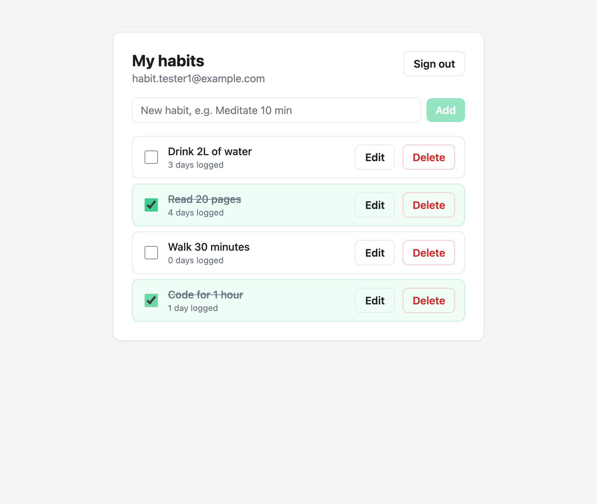 |
| Second account: empty list | 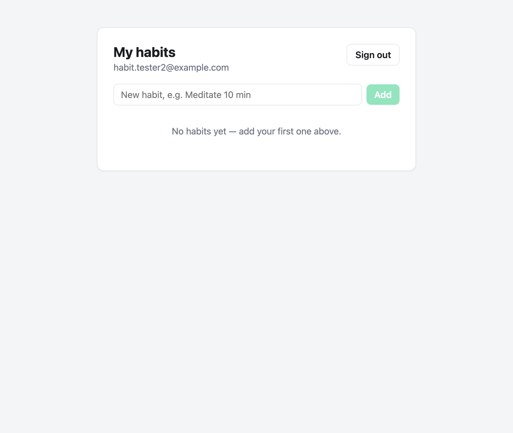 |
| SQL editor: the policies on both tables | 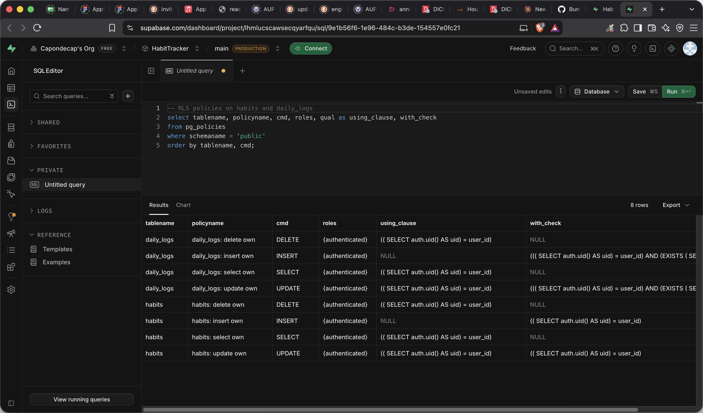 |
| `/` redirects to `/login` when signed out | 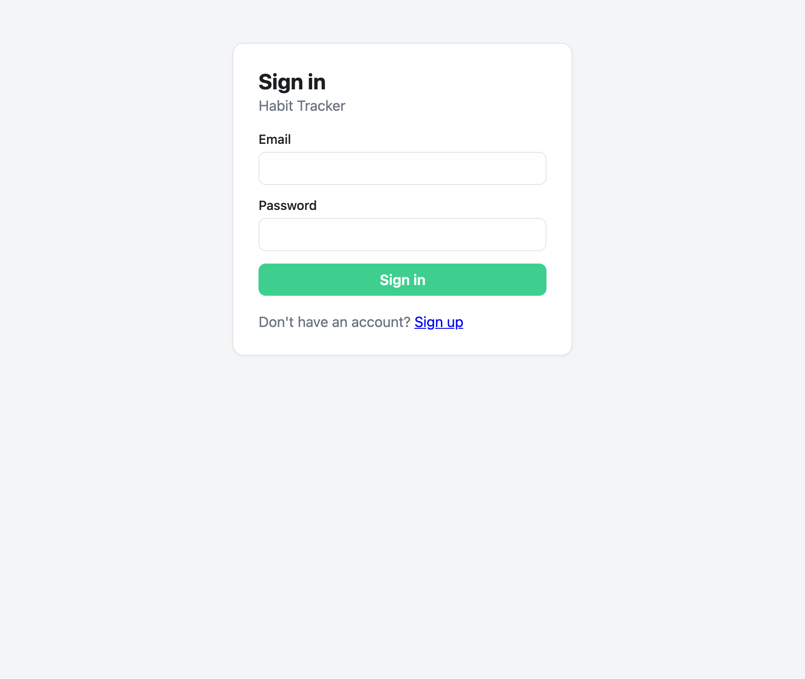 |
| Add / edit / toggle | 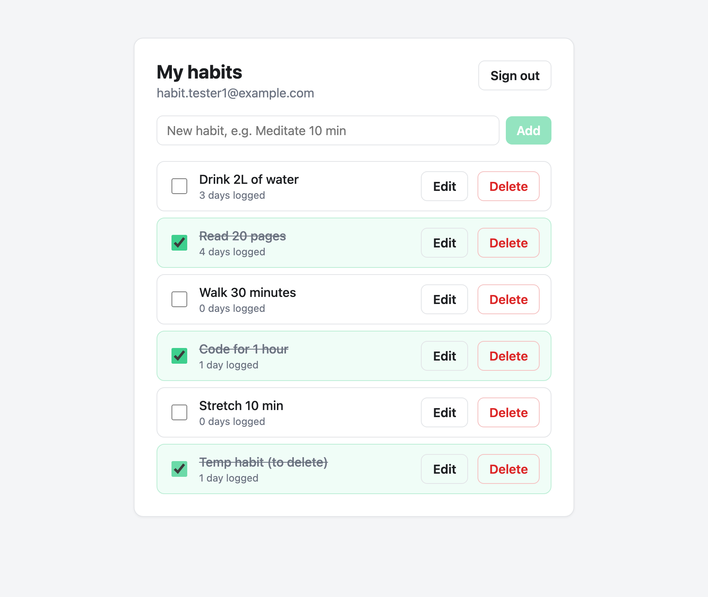 |
| After refresh | 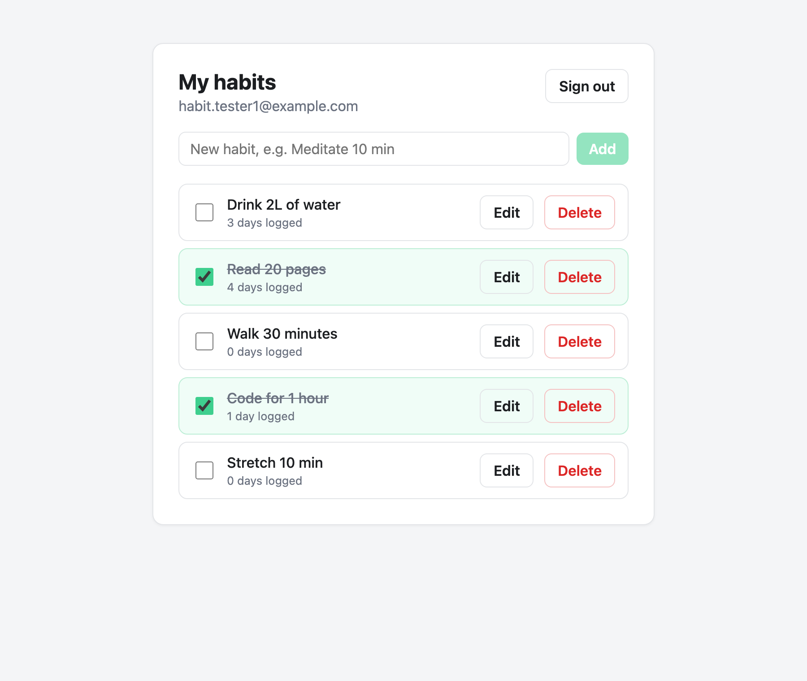 |

## Avatars & bulletproof UI

### Upload flow (`src/components/AvatarUpload.jsx`)
1. **Choose** a file with the file input.
2. **Validate** it with `validateAvatar()` (`src/lib/validateAvatar.js`). It checks that a file was chosen, that it isn't empty, that its type is PNG, JPEG, WebP or GIF (SVG is refused because it can contain scripts), and that it is at most 1 MB. A rejected file shows an inline error and the Upload button stays disabled.
3. **Preview** it with `URL.createObjectURL(file)`. The old object URL is revoked when the preview changes or the component unmounts. If the browser can't decode the image (for example a text file renamed to `.png`), the preview's `onError` refuses the file too.
4. **Upload** it to `avatars/<user id>/avatar` with `upsert: true`. The path is always the same, so a re-upload **replaces** the file instead of adding a new one.
5. **Save** the public URL to `profiles.avatar_url` with a `?v=<timestamp>` suffix, so browsers and the CDN don't keep showing the old image.
6. **Render** it on mount. `Habits.jsx` reads `profiles.avatar_url` and passes it to the nav and to the uploader.

### Storage policy (`supabase/05_storage_avatars.sql`)
Every policy on `storage.objects` (SELECT, INSERT, UPDATE, DELETE) requires `bucket_id = 'avatars' and (storage.foldername(name))[1] = (select auth.uid())::text`. The first folder in the path has to be the caller's own user id, so it doesn't open the whole bucket. Upsert needs INSERT, SELECT and UPDATE, so all three exist. The bucket also sets `file_size_limit = 1 MB` and `allowed_mime_types`, so the server refuses bad files even when a client skips the in-app check.

### Error boundaries (`src/components/ErrorBoundary.jsx`)
`ErrorBoundary` is a class component with `getDerivedStateFromError` (switch to the fallback) and `componentDidCatch` (log the error). `reset()` clears the error and re-mounts the children. The nav, profile picture, stats and habit list each sit in their own boundary with their own fallback and a **Try again** button. The nav fallback still offers **Sign out**. An outer boundary in `App.jsx` catches anything else and offers Reload instead of a white page.

**Test it:** in `npm run dev`, add `?crash=stats` (or `nav`, `avatar`, `habits`) to the URL. That section throws while rendering. Remove the parameter and click Try again to recover. `src/lib/crashTest.js` does nothing in production builds.

### Audit checklist
| Check | Result |
|---|---|
| A 5 MB file is refused client-side | ✅ `docs/screenshots/08-rejected-file-too-big.png`. It is also refused by the bucket when the client check is skipped (`docs/avatar-audit-output.txt`) |
| Re-uploading replaces the avatar (no duplicates) | ✅ The folder holds 1 object after 2 uploads, with `updated_at` later than `created_at` (`docs/reupload-check.txt`, `docs/screenshots/13-reupload-replaced.png`) |
| One crashed section shows its fallback, the rest keeps working | ✅ `14-boundary-stats-crashed.png`. `15-…still-works.png` ticks a habit and adds one while Stats is crashed. `16-boundary-habit-list-crashed.png` |
| Policy locks the folder to `auth.uid()` | ✅ `node --env-file=.env scripts/avatar-audit.mjs <emailA> <emailB> <password>`. 22/22 pass: no uploading into another user's folder or the bucket root, no overwriting, deleting or listing another user's files, no reading or changing another user's `avatar_url` (`docs/avatar-audit-output.txt`) |

### Screenshots
| | |
|---|---|
| Preview before upload | 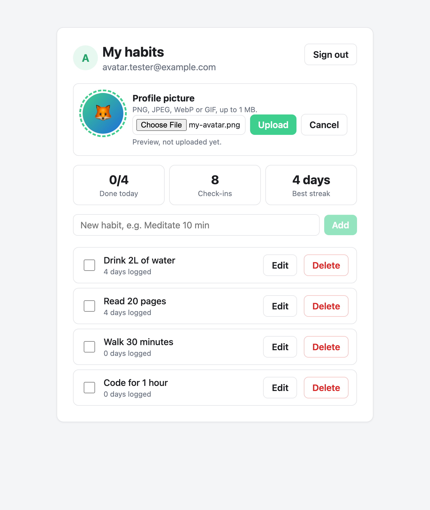 |
| Rejected file: too big (5.5 MB) | 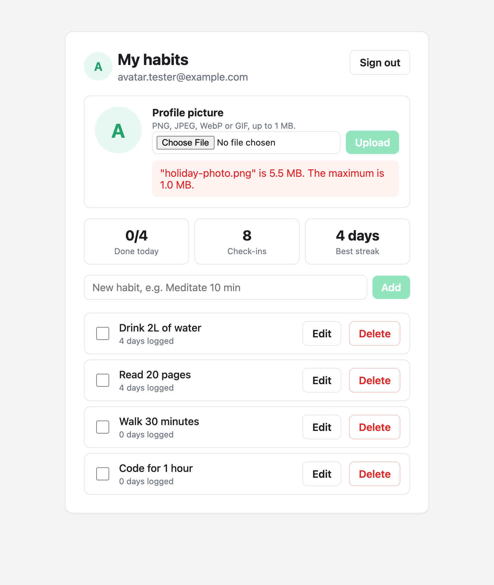 |
| Rejected file: wrong type (PDF) | 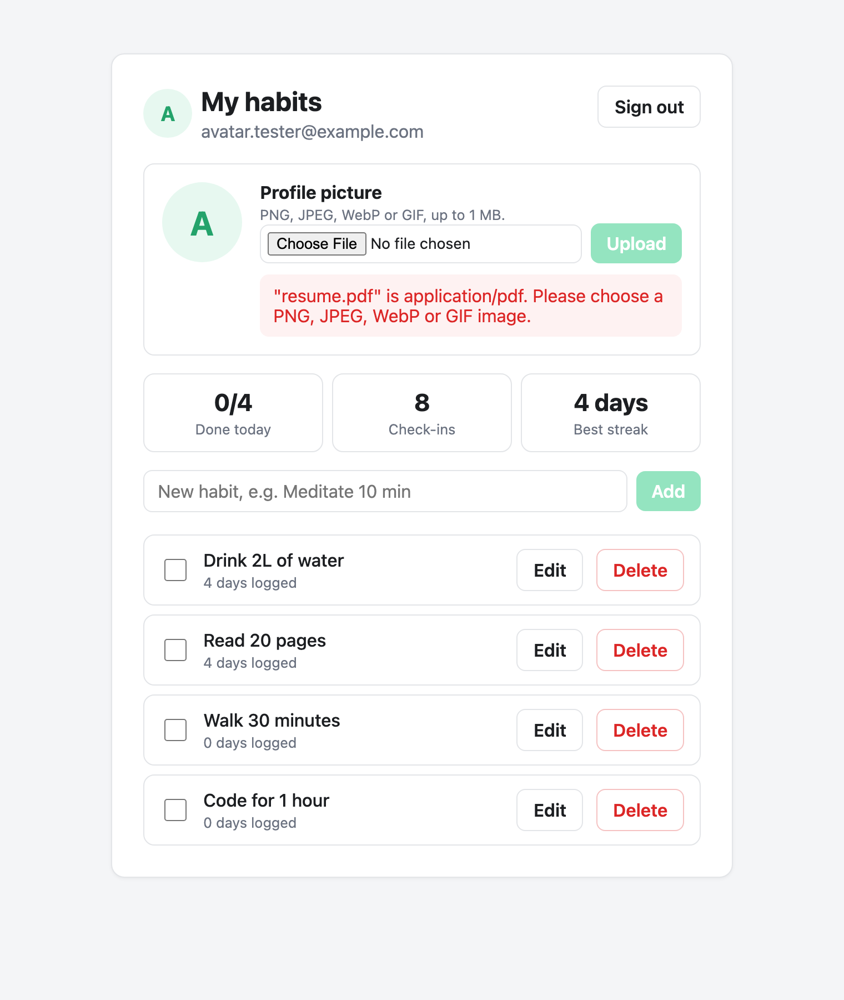 |
| Avatar rendered on a fresh load | 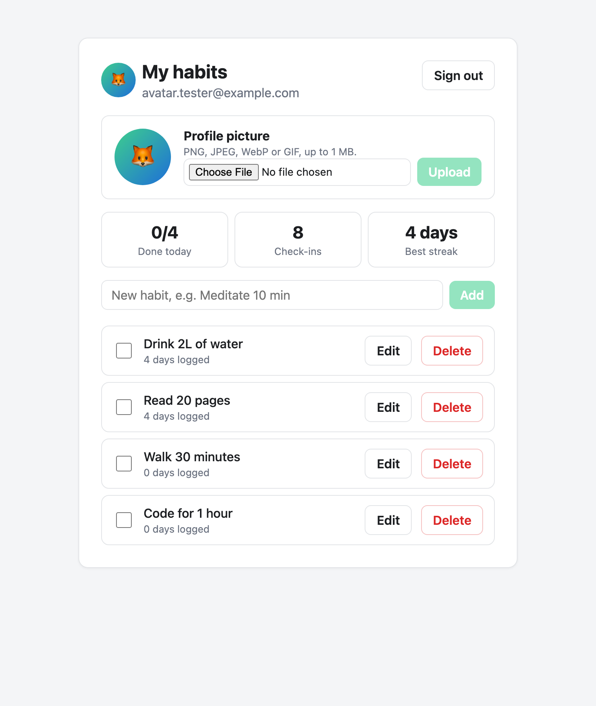 |
| Re-upload replaced the avatar | 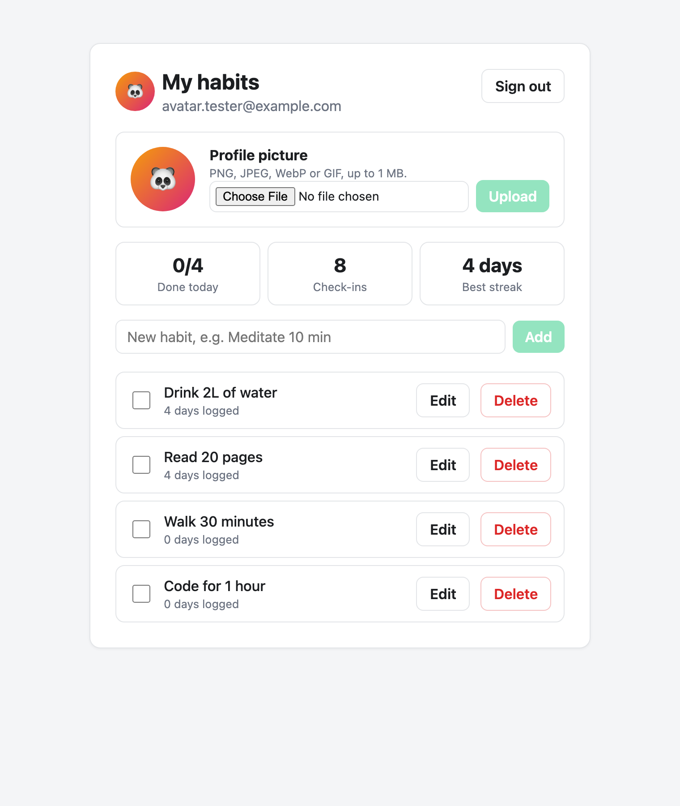 |
| Stats section crashed, the rest survives | 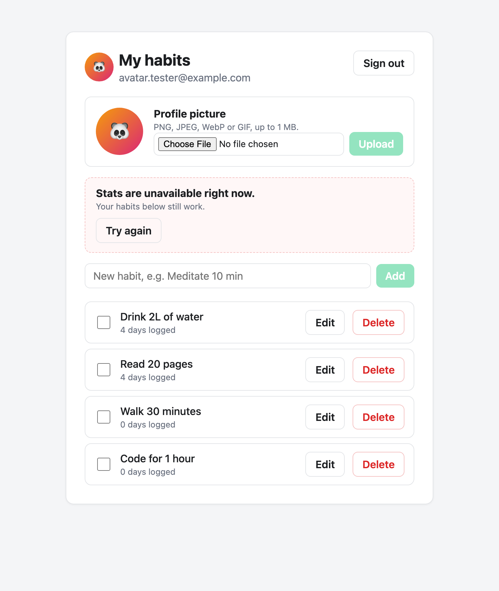 |
| While Stats is crashed, a habit is ticked and one is added | 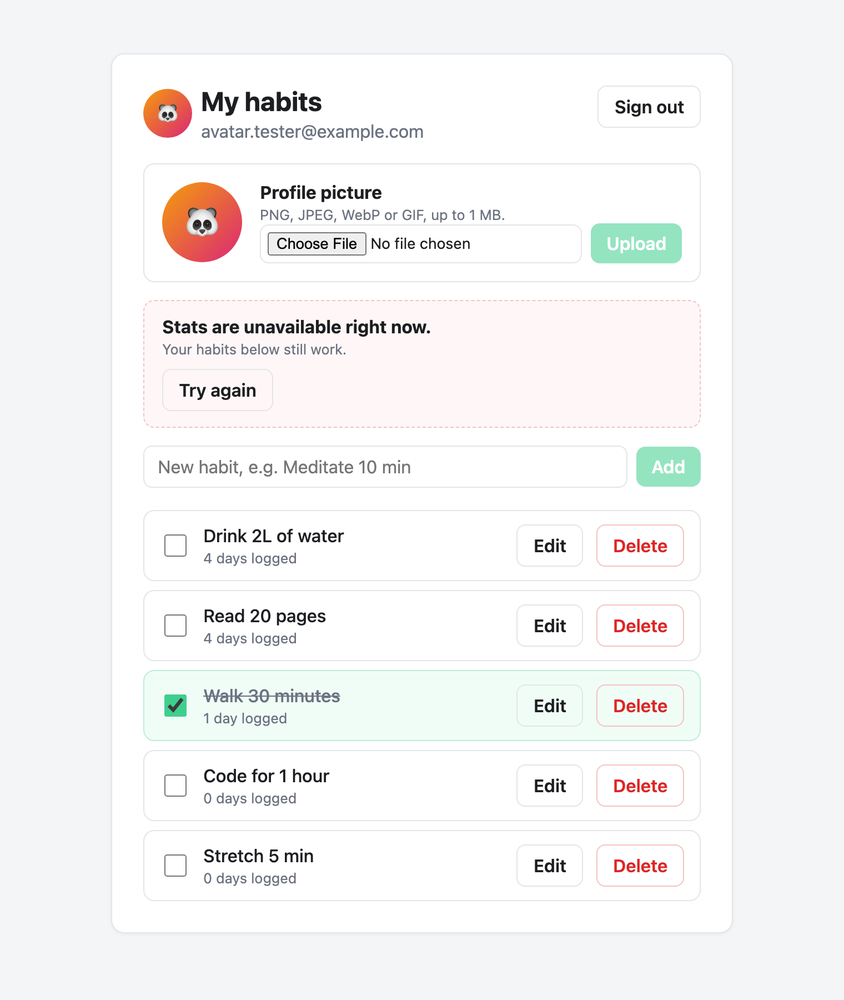 |
| Habit list crashed, nav, avatar and stats survive | 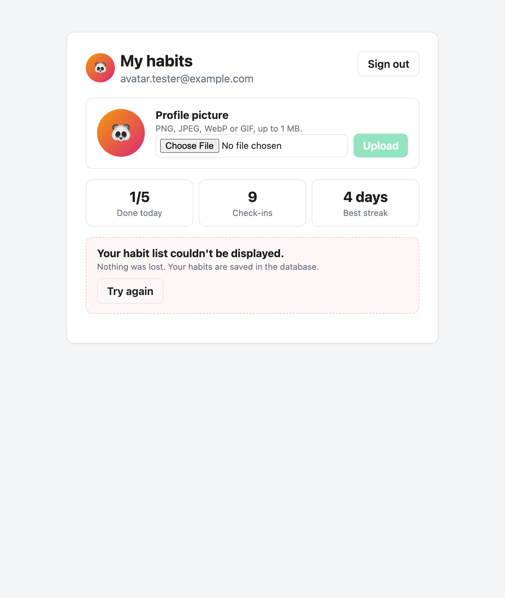 |

### Client-side validation vs the storage policy
Client-side validation is UX: it gives honest users instant, friendly feedback, but anyone can bypass it by calling the API directly. The storage policy and bucket limits are the security, because the server enforces them on every request no matter which client sends it.

## If RLS were disabled
The publishable key and project URL ship inside the deployed JavaScript bundle, so with RLS disabled anyone could take them from the browser and call the REST API directly to read, change, or delete every user's habits and logs, and insert rows for other users.
